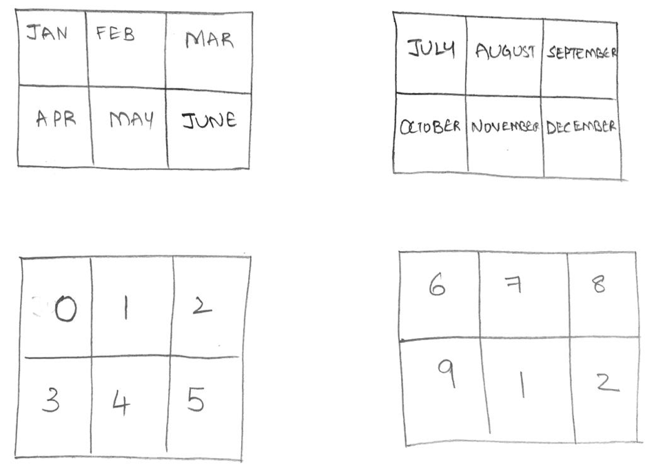

# Perpetual-Calendar
<b> 
 Question: 
 </b> 
Today we are all locked down in shelter in home due to the current COVID19 scenario. We observe that we don't want to step out for not-so-important reasons. 
Now, imagine that this started happened in the month of January and you forgot to buy a new Calendar. Since you got some time to do DIY at your home and you want to invest your time to creatively build a calendar using 4 wooden cubes that you found on your desk. 

Write a java program to implement this calendar using your 4 cubes?

Rules: You must use the first two cubes to represent the month and the rest two to represent the days. 

  
<b> 
 My answer: 
 </b>  
We can do this in the following way. For days, we first write all numbers from 0 to 9. And then we need one extra 1 and 2 numbers.
Only extra care we need to take is to put 3 in a cube which does not have 0, so that we can show 30 as well successfully.
   
Below is the pictorial representation I drew for this solution.  
</img>
